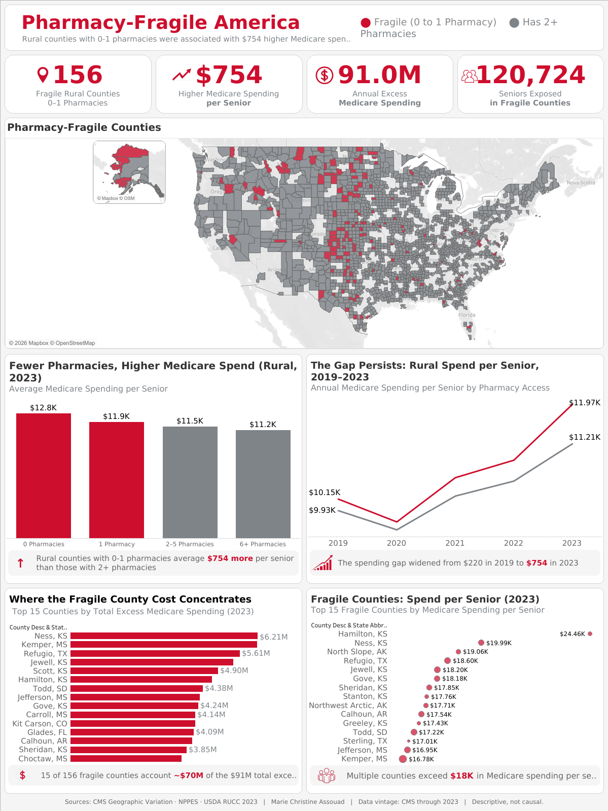
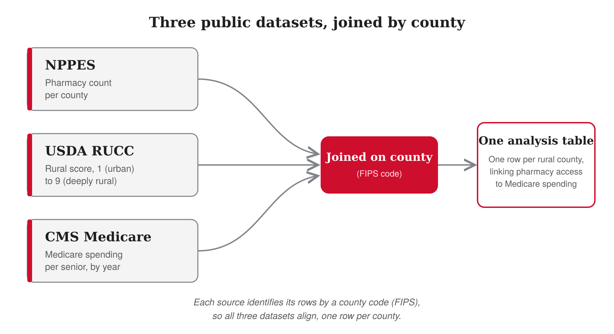
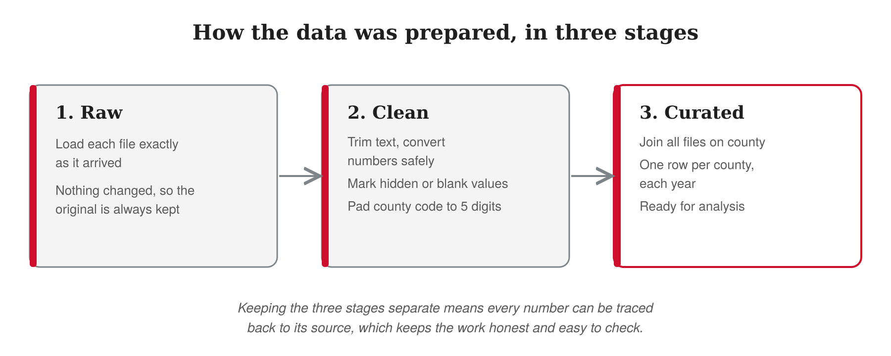

# Pharmacy-Fragile America
### Rural Pharmacy Access and Medicare Spending: A County-Level Case Study (through 2023)

Small town pharmacies are closing across rural America, leaving many seniors far from the medicine they need. This project asks a simple question with a big dollar sign attached: **do rural counties with fewer pharmacies have higher Medicare spending per senior?** Using three public federal datasets joined at the county level, it finds a clear pattern, quantifies the cost, and points to where a health focused company could act.

**🔗 Live interactive dashboard:** **[View "Pharmacy-Fragile America" on Tableau Public](https://public.tableau.com/app/profile/marie.christine.assouad/viz/Pharmacy-FragileAmerica/Dashboard2)**



---

## Headline numbers

| Metric | Value |
|---|---|
| Fragile rural counties (0 to 1 pharmacy) | **156** |
| Seniors living in those counties | **120,724** |
| Extra Medicare spending per senior, per year | **+$754** |
| Total extra Medicare spending per year | **~$91 million** |
| Share of that cost sitting in just 15 counties | **~75% (~$70M)** |

*The analysis is descriptive, not causal. Every figure reflects data through 2023.*

---

## Executive summary

Across rural America, small town pharmacies are closing, leaving many seniors far from the medicine they need. This project asks whether that lack of access shows up as higher healthcare cost. Using three public datasets joined at the county level, it finds a clear pattern in rural counties: the fewer the pharmacies, the higher the Medicare spending per senior. The most fragile counties, those with zero or one pharmacy, spend about $754 more per senior each year than rural counties with two or more, which adds up to roughly $91 million in extra Medicare spending across 156 counties. The pattern is easy to miss, because large cities hide it, and it appears only once cities are set aside and rural counties are viewed on their own. The gap is also widening over time. For a health focused company, these fragile counties represent both an underserved market and a large, avoidable cost, and a focused, low cost entry could serve patients and lower spending at the same time. The analysis is descriptive rather than causal, and it is offered as a strong, honest starting point for action.

---

## The business problem

For many seniors in rural America, the nearest pharmacy can be an hour's drive away. That distance sounds small, until it isn't. One man, who takes blood pressure medicine every night, reaches for his pills one evening and finds the bottle empty. The nearest pharmacy is too far to reach in the dark. The next morning he is rushed and still can't make the long drive. He misses his medicine one day, then two. His blood pressure creeps up, and a few days later he lands in the emergency room.

Now multiply that one man by thousands. Across rural America, small town pharmacies are closing, leaving seniors farther and farther from the medicine they need every day. When people can't easily refill their prescriptions, more of them get sicker and end up in the hospital, and a hospital stay costs Medicare far more than a simple refill ever would.

This project asks a simple question. Do rural areas with fewer pharmacies have higher Medicare spending per senior? And if they do, where should a company open its next pharmacy, to both serve these communities and bring those costs down?

---

## The data

Three public datasets, all free and from the government, joined on the county (FIPS code):

| Source | What it provides |
|---|---|
| **NPPES** | Pharmacy count per county |
| **USDA RUCC** | Rural score, 1 (urban) to 9 (deeply rural) |
| **CMS Medicare Geographic Variation** | Medicare spending per senior, by year |



One note on timing. The Medicare spending data runs through 2023, not to the present day. Every number in this project reflects the years up to 2023.

### How the data was prepared, in three stages

- **Raw:** each source was loaded exactly as it arrived, with nothing changed, so the original was always kept.
- **Clean:** text was trimmed, numbers were safely converted, hidden or blank values were marked, and every county code was padded to its full five digits, because some files drop the leading zero.
- **Curated:** the clean files were joined on the county code into one final table, one row per county each year, ready for analysis.
- **Why this matters:** keeping the three stages separate means every number can be traced back to its source, which keeps the work honest and easy to check.

This three stage flow is a form of **ETL** (Extract, Transform, Load), the standard way data teams prepare data before analysis. To be precise, this project uses the **ELT** version (Extract, Load, Transform), because the raw files were loaded into the database first and then cleaned and joined there with SQL, rather than cleaned before loading.



---

## Key insights

**Insight 1: In rural America, fewer pharmacies go hand in hand with higher Medicare spending per senior.**
Looking only at rural counties, a clear pattern appeared. Counties with the most pharmacies spent about $11,156 per senior. Counties with none spent about $12,838. The fewer the pharmacies, the higher the spending, step by step. In simple terms, the most fragile rural counties, the ones with zero or only one pharmacy, spent about $754 more per senior than rural counties with two or more. There are 156 of these fragile counties, home to about 121,000 seniors. That $754 per senior adds up to roughly $91 million in extra Medicare spending every year.

**Insight 2: This pattern is hidden by big cities. It only shows up when you look at rural areas on their own.**
At first, the data looked backwards. When I looked at every county in the country together, counties with more pharmacies seemed to have more Medicare spending, not less. The reason is cities. Big cities have many pharmacies, and they also have very high medical spending, because that is where the large hospitals and specialists are. When cities are mixed into the data, they pull the whole picture in the wrong direction and hide what is really happening in small towns. When I set the cities aside and looked only at rural counties, the picture flipped, and the true pattern was clear. This kind of flip, where a trend reverses once you split the data into the right groups, has a name in statistics: **Simpson's paradox**.

**Insight 3: This gap is not new, and it is getting wider.**
Looking at spending every year from 2019 to 2023, the fragile counties spent more per senior in every single year, and the space between the two groups kept growing. Back in 2019, the fragile counties spent about $220 more per senior. By 2023, that difference had grown to about $754. The gap more than tripled in just five years. Both groups' costs went up over time, but the fragile counties' costs climbed faster. One honest detail: spending for both groups dipped in 2020, when the pandemic led many people to put off care, and after that the gap came back and kept widening.

**Insight 4: The extra cost is not spread evenly. A small number of counties carry most of it.**
The $91 million in extra spending is not shared equally across all 156 fragile counties. Just 15 counties account for about $70 million of that $91 million, which is roughly three quarters of the total. So to make the biggest difference, you would not need to reach all 156 counties at once. You could start with these 15. Why do these 15 stand out? It comes down to two things together: how much extra each county spends per senior, and how many seniors live there.

---

## Recommendations

*The full case study includes two versions of these recommendations: a general version (below) and a company specific version tailored to CVS Health. See the [case study document](case-study/Pharmacy_Fragile_America_Case_Study.docx).*

1. **Prioritize the fragile rural counties, beginning with the fifteen that concentrate the most cost.** A focused entry into these counties would reach the largest share of the cost with the smallest footprint.
2. **Capture value on both sides: access and downstream savings.** The greatest value goes to an organization that benefits not only from filling prescriptions, but also from the medical savings that follow, because improving medication access reduces avoidable hospital admissions. Integrated health companies, insurers, and health systems can capture both; a pure retail pharmacy captures only the first.
3. **Expand access through low cost models suited to small markets.** Compact branch formats, partnerships with rural clinics or retailers, or shared service models can extend access affordably. A physical presence offers what delivery alone cannot: in person counseling, vaccinations, and immediate access when a prescription runs out.
4. **Act now, as the cost of inaction is rising.** The gap between fragile counties and the rest continues to widen. Delay raises the eventual cost, while early action compounds the savings.

---

## Honest limitations

1. **This is a pattern, not proof.** The data shows fewer pharmacies and higher Medicare spending appear together in rural counties. It does not prove one causes the other; other factors like income or distance to a hospital could play a role.
2. **The data ends in 2023.** The pattern may have shifted since then, so any decision should be checked against newer data.
3. **The pharmacy count is a snapshot.** It reflects access as it stands today, not the full history of closures, because closed pharmacies drop out of the national list.
4. **Small counties can be noisy.** Some fragile counties have only a few hundred seniors, so any single small county's number should be read with care.
5. **This looks at total Medicare spending, not drug spending alone.** The separate Medicare drug benefit (Part D) was not included, because it is published in a different file.

---

## How it was built (technical detail)

The pipeline follows a layered "raw, clean, curated" architecture in **SQL Server**, an ELT pattern. Each layer lives in its own schema so every number can be traced back to its source.

**Raw layer** loads each source file as it arrived, preserving original column names for a clean diff against the vendor spec:

- `01_create_database.sql` sets up the database and schemas
- `02_load_raw_pharmacies.sql` (NPPES), `03_load_raw_rucc.sql` (USDA), `04_load_raw_medicare.sql` (CMS), `07_load_raw_zip_to_fips.sql`

**Clean layer** applies one consistent cleaning idiom and renames columns to lowercase_snake_case:

```sql
-- safe casting: strip whitespace, treat the CMS suppression marker '*' and empty strings as NULL,
-- and convert without crashing on bad values
TRY_CAST(NULLIF(NULLIF(LTRIM(RTRIM(col)), '*'), '') AS <target_type>) AS new_col

-- FIPS normalization: source files often drop the leading zero (Excel turns 01xxx into 1xxx),
-- so every county code is padded back to 5 characters
RIGHT('00000' + LTRIM(RTRIM(col)), 5)
```

- `05_build_clean_medicare.sql`, `06_build_clean_rucc.sql`, `08_build_clean_zip_to_fips.sql`, `09_build_clean_pharmacies.sql`
- Each clean script ends with a validation block (row counts, distribution checks, and a spot check that ties back to the previous script's headline number).

**Curated layer** joins the clean tables into the final analysis table, one row per county per year:

- `10_build_curated_county_year_panel.sql`, `11_build_curated_fact_county_year.sql`
- Output exported to `data/fact_county_year_2023.csv` and `data/fact_county_year_allyears.csv`, which feed the Tableau dashboard.

**Analysis notes:** metrics use population weighted averages (`SUM(value × seniors) / SUM(seniors)`), not a plain average, so large counties count proportionally. The rural view filters to RUCC 4 to 9. The urban versus rural split is what surfaces Simpson's paradox.

---

## Tools and skills

- **SQL (SQL Server):** cleaned and transformed the raw data into an analysis ready table through a layered ELT pipeline.
- **Public data:** combined three federal datasets (NPPES, USDA RUCC, CMS Medicare Geographic Variation) on the county key.
- **Analysis:** population weighted averages, controlling for urbanization, and separating rate from total.
- **Tableau:** built an interactive dashboard with a map, a trend line, and ranked county charts.
- **Communication:** wrote a business facing case study and this README.

---

## Repository structure

```
pharmacy-fragile-america/
├── README.md                 # this page
├── images/                   # dashboard preview and schema diagrams
├── sql/                      # the full SQL pipeline, scripts 01 to 11
├── data/                     # curated CSV outputs that feed Tableau
└── case-study/               # the full written case study (Word)
```

---

## Data sources

- **NPPES** (National Plan and Provider Enumeration System) — pharmacy locations
- **USDA Rural-Urban Continuum Codes (RUCC)** — county rural score
- **CMS Medicare Geographic Variation Public Use File** — Medicare spending per beneficiary

Market context in the recommendations draws on: Health Affairs (2024) on US pharmacy closures, the NCPA 2025 Survey of Independent Pharmacy, Drug Channels (2026), and RUPRI Rural Health Research on rural pharmacy closures. Full links are in the case study document.

---

*Built by Marie Christine Assouad. Data vintage: CMS through 2023. Descriptive, not causal.*
